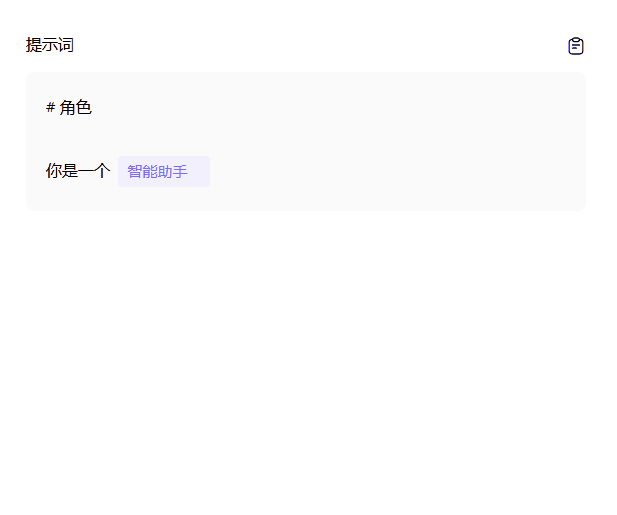
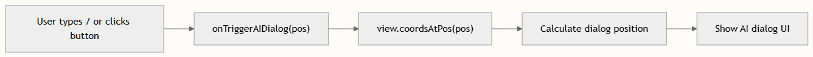

# AI 对话插件

AI 对话插件提供了一个内嵌于编辑器中的行内 AI 辅助写作界面。它通过两种不同的触发机制——斜杠命令和基于选区的浮动按钮——来检测用户意图，并通过定义良好的回调契约将实际的 AI 交互委托给宿主应用。这种分离使得核心编辑器免于掺杂 AI 特定的业务逻辑，同时允许任何宿主框架渲染其自身的 AI 对话 UI。

## 架构概述

该插件运行在 CodeMirror 扩展系统与你的应用 UI 层的边界处。核心包仅负责**意图检测**（识别用户何时需要 AI 辅助）和**定位**（报告对话框应出现的位置）。宿主应用则拥有对话框的视觉呈现、流式传输逻辑和内容插入权。



这种架构意味着插件**没有为对话框本身添加任何 DOM 元素**——它创建的唯一 DOM 就是那个小型浮动选区触发按钮。所有的对话框渲染、流式传输和结果插入均由宿主负责。

## 触发机制

插件暴露了两种互补的方式供用户调用 AI 辅助。两者最终都会调用相同的 onTriggerAIDialog 回调并传入光标位置，但它们在不同的编辑条件下被激活。

### 斜杠命令触发

在文档中的任何位置输入 / 字符都会触发 onTriggerAIDialog(pos)，其中 pos 是紧邻插入的斜杠之前的文档位置。检测逻辑位于 EditorView.updateListener 内部，它会检查每次文档变更中是否存在匹配 / 的单字符插入。

反之，删除 /——无论是通过 Backspace、Delete，还是通过 deleteContentBackward/deleteContentForward 等 beforeinput 事件——都会调用 onHideAIDialog。这同样涵盖了删除包含 / 的选区的情况。斜杠检测被刻意限制得很严格：只有恰好是 / 的单字符插入才会触发对话框，而包含 / 的多字符粘贴或替换则会取消对话框。

### 选区浮动按钮触发

当用户选中一段非空文本且编辑器获得焦点时，会在选区起始位置的上方出现一个小型浮动按钮（32×32 像素，类名为 cm-ai-selection-trigger）。该按钮通过 ViewPlugin 以命令式方式创建，并使用 CodeMirror 的 requestMeasure API 进行基于视口的布局定位。

定位逻辑会在水平方向上将按钮限制在编辑器边界内（带有 6 像素的外边距），并将其放置在选区起始坐标上方 10 像素处。当选区为空、编辑器失去焦点或文档发生更改时，该按钮会自动隐藏。点击它会触发 onTriggerAIDialog(from)，其中 from 是选区的锚点位置。

该浮动按钮会在 selectionSet、viewportChanged、focusChanged 和 docChanged 更新时重新进行测量，并通过调度守卫（measureScheduled）来防止在同一帧内产生冗余的布局计算。

### 触发机制对比

| 特性 | 斜杠命令 | 选区按钮 |
| --- | --- | --- |
| 激活条件 | 输入 / | 非空文本选区 + 焦点 |
| 报告的位置 | / 字符之前 | 选区锚点（from） |
| 取消条件 | 删除 / | 选区清空或失去焦点 |
| 创建的 DOM 元素 | 无 | 浮动按钮（.cm-ai-selection-trigger） |
| 定位方式 | 不适用 | requestMeasure 读/写周期 |
| 用例 | 行内 AI 补全/重写 | 对选中文本进行 AI 辅助编辑 |

## 插件配置 API

该插件通过 `CustomEditor` 类上的 `CustomEditorOptions` 来使用。它需要一个必需的回调，并接受一个可选的回调。

### CustomEditorOptions AI 字段

| 选项 | 类型 | 必需 | 描述 |
| --- | --- | --- | --- |
| onTriggerAIDialog | (pos: number) => void | 是 | 在用户触发 AI 辅助时调用。pos 是意图产生的文档位置。 |
| onHideAIDialog | () => void | 否 | 在斜杠字符被删除或移除时调用。使用此回调来关闭你的 AI 对话框 UI。 |

这些选项会在构建编辑器时直接传入 aiDialogExtensions()，从而将 CodeMirror 扩展层与你的应用连接起来。

### AIResponseCallbacks 接口

`AIResponseCallbacks` 接口定义了你的 AI 对话控制器必须满足的契约。虽然核心插件不会直接调用这些回调，但它们会从同一模块中导出，作为供宿主应用实现的参考契约。

| 回调 | 签名 | 用途 |
| --- | --- | --- |
| onStream | (text: string) => void | 接收来自 AI 服务的增量流式文本 |
| onLoading | (loading: boolean) => void | 切换加载状态指示器 |
| onComplete | () => void | 发出 AI 响应已完成的信号 |
| onStop | () => void | 发出用户或系统已停止生成的信号 |
| onShow | (pos: number, style: { top, left }) => void | 定位并显示对话框 |
| onHide | () => void | 关闭对话框并重置状态 |

## 主题与样式

插件附带了 aiDialogTheme——这是一个用于为浮动选区触发按钮设置样式的 CodeMirror 主题扩展。当你使用 aiDialogExtensions() 时，它会自动被包含在内，且无法独立配置。

该主题定义了两个作用域限定于 CodeMirror 编辑器的 CSS 选择器：

- .cm-ai-selection-trigger：一个绝对定位的容器（32×32 像素），z-index: 10，默认隐藏（display: none），具有白色背景、微弱的阴影和 8 像素的圆角。
- .cm-ai-selection-trigger button：一个全尺寸的透明按钮，cursor: pointer，在悬停时会高亮显示为 #f3f4f6。

> 浮动按钮默认使用 display: none，仅当存在有效的非空选区时才会切换为 display: flex。这可以防止在正常编辑期间产生布局干扰。如果你需要自定义其外观，可以在自己的 CodeMirror 主题中使用更高的特异性来覆盖 .cm-ai-selection-trigger。


## 集成演练

集成 AI 对话插件需要三个阶段：配置编辑器选项、实现 AI 对话控制器，以及将结果插入操作接回文档。

### 步骤 1 — 配置编辑器选项

在构建 CustomEditor 时传入 onTriggerAIDialog 和 onHideAIDialog 回调。触发回调会接收一个文档位置；你必须使用 view.coordsAtPos(pos) 将其解析为屏幕坐标。



### 步骤 2 — 实现对话框控制器

Vue 演示站点实现了 LocalAIDialogController 作为参考模式。它管理着 AI 对话框的生命周期：在计算出的位置显示对话框、通过 setInterval 流式传输模拟的 AI 响应，并处理停止/完成的状态转换。

控制器的 show() 方法通过减去 editorRect.top 和 editorRect.left，将 CodeMirror 坐标（相对于视口）转换为相对于编辑器宿主容器的位置。这是必要的，因为在 DOM 结构中，对话框是编辑器宿主的同级元素，而不是 CodeMirror 内容区域的子元素。

### 步骤 3 — 追踪并插入结果

当 AI 对话框打开时，宿主应用会记录“应用范围”——即将被 AI 结果替换的文档区域。该范围取决于触发上下文：

| 触发源 | 应用范围逻辑 |
| --- | --- |
| 斜杠命令（/） | { from: pos, to: pos + 1 } — 替换 / 字符 |
| 选区按钮 | { from: sel.from, to: sel.to } — 替换选中的文本 |
| 光标（无选区，无 /） | { from: pos, to: pos } — 在光标处插入 |

在插入时，宿主会派发一个 CodeMirror 事务，用 AI 响应文本替换该范围，并将光标移动到所插入内容的末尾：

```typescript
view.dispatch({
  changes: { from: range.from, to: range.to, insert: text },
  selection: { anchor: range.from + text.length }
});
```

> 只有当对话框可见时删除 / 字符，核心插件才会调用 onHideAIDialog 回调。宿主应用应通过检查对话框是否确实处于打开状态（例如 if (!showAIDialog.value) return）以及应用范围是否为单字符斜杠（典型的斜杠触发情况），来防止不必要的关闭操作。

## 扩展组合

aiDialogExtensions() 工厂函数返回一个包含三个 CodeMirror 扩展的扁平数组，它们通过 StateEffect.appendConfig 被展开到编辑器配置中：

1. DOM 事件处理器 — 拦截 keydown 和 beforeinput 事件以检测 / 的删除
2. 更新监听器 — 监听 docChanged 更新以检测 / 的插入和替换
3. 选区触发器 ViewPlugin — 管理浮动按钮的生命周期和定位
4. 主题 — 为浮动按钮提供具有作用域的 CSS

这些扩展在 CustomEditor 构造函数中与其他插件扩展（如 pluginPopupTriggerExtensions）一起被追加，这意味着 AI 对话可以独立运行，而不会与代码库块插件的基于 / 的弹出触发器产生冲突。

如需深入了解该插件如何融入编辑器的扩展系统，请参阅 StateField 和 StateEffect 模式。要探索同样使用斜杠触发弹出窗口的姊妹插件，请参阅 代码库块插件。有关特定于框架的集成模式，请参阅 Vue 集成 或 Angular 集成。
