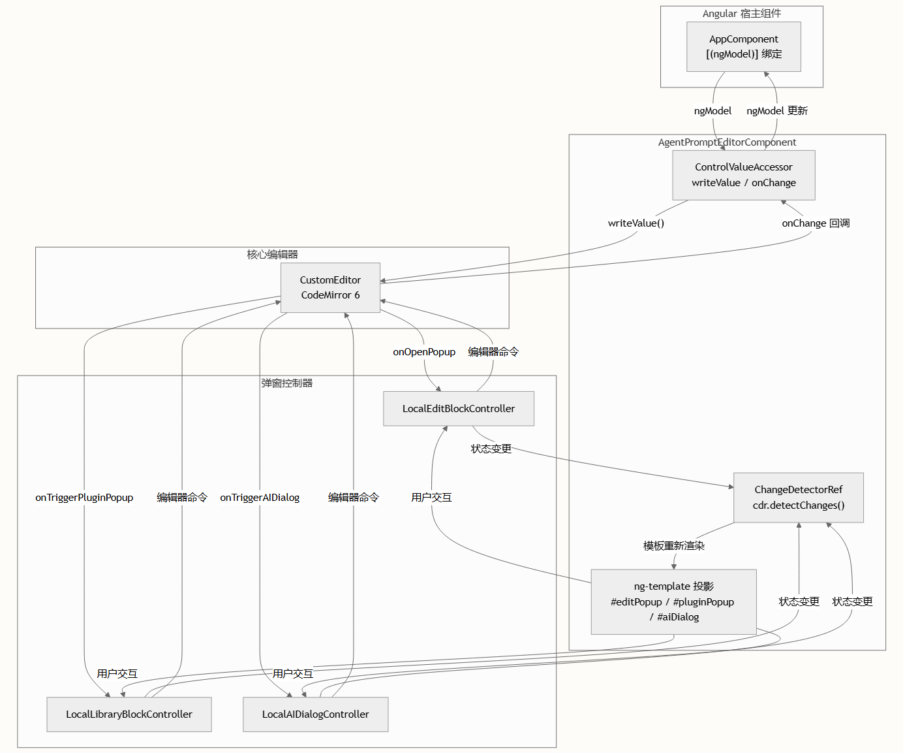
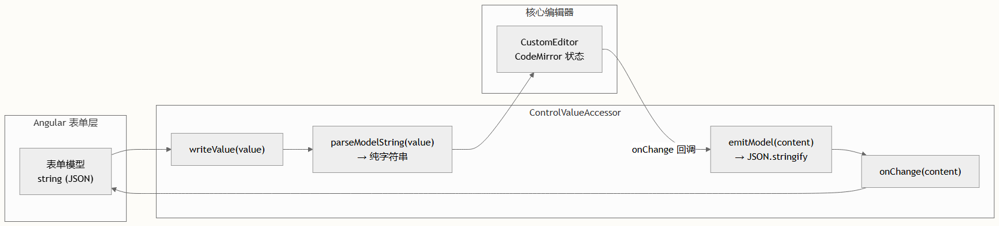

# Angular 集成

`@agent-arts/editor` 核心包是与框架无关的——它会生成一个附加到任意 DOM 元素的 CodeMirror 6 视图。Angular 集成层位于 `packages/site-ng/` 目录中，展示了如何将此编辑器封装为一个**独立的 Angular 组件**，该组件实现了 `ControlValueAccessor`，支持通过 `ng-template` 进行基于模板的弹窗定制，并通过 Angular 的依赖注入（DI）和变更检测系统来管理编辑器生命周期。

## 架构概述

该集成遵循**薄封装**模式：Angular 掌管组件生命周期和模板层，而核心的 `CustomEditor` 负责处理所有的 CodeMirror 状态、装饰和序列化。通信通过在构造时传入 `CustomEditorOptions` 的回调选项向内传递，并通过 Angular 的 `ChangeDetectorRef` 向外传递以触发视图更新。



这种架构使编辑器核心免于 Angular 依赖，同时封装层提供了符合 Angular 风格的易用性——通过 `ngModel` 实现双向绑定，通过内容投影实现弹窗定制，并通过 `OnDestroy` 进行适当的清理。

## 项目设置

Angular 演示项目位于 `packages/site-ng/`，使用 Angular 18 及独立组件。工作区通过 `pnpm-workspace.yaml` 进行配置，并且 `site-ng` 项目依赖于 monorepo packages 中的 `@agent-arts/editor`。

package.json 中的关键依赖声明：

| 包名 | 用途 |
| --- | --- |
| `@agent-arts/editor` | 核心编辑器（CustomEditor、类型） |
| `@angular/core` | 组件基础设施、DI、生命周期 |
| `@angular/forms` | 用于 `ngModel` 的 `NG_VALUE_ACCESSOR`、`FormsModule` |
| `@angular/common` | 用于 `*ngIf`、`*ngFor` 指令的 `CommonModule` |

`@agent-arts/editor` 包通过指向 `dist/editor.js` 的 `module` 字段导出其 ESM 入口，并通过 `dist/index.d.ts` 导出类型，Angular 的构建管道会透明地解析它们。`angular.json` 构建配置使用标准的 `@angular-devkit/build-angular:application` 构建器，并将 SCSS 作为内联样式语言。

## 组件设计：AgentPromptEditorComponent

编辑器封装是一个带有 `ViewEncapsulation.None` 的独立组件——这一点至关重要，因为 CodeMirror 会注入其自身的 DOM 结构和 CSS 类，这些绝不能被 Angular 的模拟封装限定作用域。

### 组件元数据

agent-prompt-editor.component.ts：

```typescript
@Component({
  selector: 'agent-prompt-editor',
  standalone: true,
  imports: [CommonModule, FormsModule],
  templateUrl: './agent-prompt-editor.component.html',
  styleUrls: ['./agent-prompt-editor.component.scss'],
  encapsulation: ViewEncapsulation.None,
  providers: [
    {
      provide: NG_VALUE_ACCESSOR,
      useExisting: forwardRef(() => AgentPromptEditorComponent),
      multi: true
    }
  ]
})
```

`NG_VALUE_ACCESSOR` 提供者注册正是使组件能够使用 `[(ngModel)]` 的关键。此处必须使用 `forwardRef`，因为在 TypeScript 中计算装饰器时类引用尚不可用。

### 模板内容投影

组件使用 `@ContentChild` 允许使用者通过 `ng-template` 提供自定义弹窗模板。共有三个投影插槽可用：

| 内容子项 | 模板上下文变量 |	用途 |
| --- | --- | --- |
| `#editPopup` | `$implicit`（组件引用）、`block`（EditorBlock）、`style` | 自定义编辑块配置弹窗 |
| `#pluginPopup` | `$implicit`（组件引用）、`library`（控制器）、`style` | 自定义插件库选择弹窗 |
| `#aiDialog` | `$implicit`（组件引用）、`style` | 自定义 AI 生成对话框 |

如果未提供自定义模板，则会渲染默认的内置模板。这是通过组件模板中的 `*ngIf` / `else` 切换实现的：

```html
<ng-container
  *ngIf="editPopupTpl; else defaultEditPopup"
  [ngTemplateOutlet]="editPopupTpl"
  [ngTemplateOutletContext]="{ $implicit: this, block: editingBlock, style: popupStyle }"
></ng-container>
```

### 弹窗状态管理

组件维护三组独立的弹窗状态，每组都包含显示/隐藏标志、定位样式及关联数据：

- 编辑块弹窗：showPopup、popupStyle、editingBlock、editPlugin
- 插件弹窗：showPluginPopup、pluginStyle、libraryPlugin
- AI 对话框：showAIDialog、aiDialogStyle、aiQuestion、aiResponseText、isGenerating、aiLoading、aiFinished、aiApplyRange、aiPlugin

每个弹窗控制器（LocalEditBlockController、LocalLibraryBlockController、LocalAIDialogController）都在 ngOnInit 中实例化，这些实例化的回调会更新上述状态属性，并调用 cdr.detectChanges() 以手动触发 Angular 的变更检测。

## 生命周期集成

编辑器生命周期与 Angular 的组件生命周期钩子紧密绑定，以确保命令式的 CodeMirror 实例能够正确初始化和清理。

### 初始化 (ngOnInit)

在 ngOnInit 期间，组件构造 CustomEditorOptions 并实例化核心编辑器，将其附加到通过 @ViewChild 引用的 #editorHost DOM 元素上：

```typescript
const options: CustomEditorOptions = {
  parent: this.editorHost.nativeElement,
  initialDoc: initialContent ?? '',
  onOpenPopup: (id, rect) => this.openPopup(id, rect),
  onTriggerPluginPopup: (pos) => this.openPluginPopup(pos),
  onHidePluginPopup: () => this.closePopup(),
  onTriggerAIDialog: (pos) => this.openAIDialog(pos),
  onHideAIDialog: () => { /* 条件清理 */ },
  onChange: (data) => this.emitModel(data),
  onBlockUpdated: (id, text) => { /* 同步编辑块状态 */ }
};
this.editor = new CustomEditor(options);
```

为编辑器 DOM 附加了一个失焦（blur）监听器，用于处理 Angular 的 `onTouched` 回调，从而实现表单控件脏/原始状态（dirty/pristine）的正确追踪。如果在编辑器实例化之前调用了 `writeValue`（在异步表单初始化中很常见），则会在构造完成后立即刷新挂起的值。

### 清理 (ngOnDestroy)

销毁钩子会移除失焦监听器并调用 `editor.destroy()`，同时清理 AI 对话框控制器：

```typescript
ngOnDestroy() {
  if (this.editor) {
    this.editor.view.dom.removeEventListener('blur', this.blurListener, true);
    this.editor.destroy();
  }
  if (this.aiPlugin) {
    this.aiPlugin.destroy();
  }
}
```

失焦监听器上的 `capture: true` 标志确保能够可靠地捕获所有失焦事件——包括来自 CodeMirror 复杂 DOM 树中子元素的事件。

## 基于 ControlValueAccessor 的双向数据流

组件实现了 ControlValueAccessor 接口，从而能够通过 `[(ngModel)]` 或响应式的 formControlName 接入 Angular 表单。数据模型是一个序列化的 JSON 字符串，表示带有嵌入块元数据的编辑器内容。

### 值转换管道



writeValue 方法从 Angular 表单层接收一个 JSON 字符串，将其解析为供编辑器使用的纯字符串，并通过 recreateEditor 应用——销毁现有的 CodeMirror 实例并使用新内容重新创建。suppressModelEmit 标志用于防止在程序化写入期间发生循环更新。

来自 CustomEditorOptions 的 onChange 回调接收原始编辑器内容字符串，并将其传播回 Angular 的表单层。

> 这里使用 recreateEditor 模式（销毁 + 重建）而不是就地替换文档，是因为核心编辑器的块状态和装饰是在构造期间计算的。对于频繁的模型更新，建议对 writeValue 调用进行防抖处理，或使用差异比对策略以避免不必要的编辑器重建。

## 在宿主组件中使用

父组件使用 [(ngModel)] 进行双向绑定，并通过内容投影提供自定义弹窗模板。以下来自 app.component.html 的模式展示了这一点：

```html
<agent-prompt-editor [(ngModel)]="editorModel">
  <!-- 带有变量、插件和工作流的自定义插件弹窗 -->
  <ng-template #pluginPopup let-comp let-library="library" let-style="style">
    <div class="plugin-category">
      <div class="category-title">用户变量</div>
      <div *ngFor="let name of library.userVariables"
           class="variable-item" (click)="addVariableBlock(name)">
        <span class="item-name">{{ name }}</span>
      </div>
    </div>
    <div class="plugin-category">
      <div class="category-title">插件</div>
      <div *ngFor="let item of library.plugins"
           class="plugin-item" (click)="addPluginBlock(item)">
        
        <span class="item-name">{{ item.name }}</span>
      </div>
    </div>
  </ng-template>
 
  <!-- 带有插入操作的自定义 AI 对话框 -->
  <ng-template #aiDialog let-comp let-style="style">
    <button (click)="comp.insertAIResult('  </ng-template>
</agent-prompt-editor>
```

父组件通过 @ViewChild 访问编辑器组件，以调用命令式方法，如 addBlock()、addPluginBlock()、addVariableBlock() 和 closePopup()。

### 编辑器模型格式

模型值是一个 JSON 字符串。父组件在 ngAfterViewInit 中对其进行初始化：

```typescript
this.editorModel = JSON.stringify({
  content: '# 角色\n\n你是一个  。变量{{user_name}}。--test',
  editorBlocks: [
    {
      pos: 11,
      block: { id: 'init-block-1', placeholder: '请输入...', presetText: '智能助手' }
    }
  ],
  pluginBlocks: []
});
```

## 模板结构与样式

组件模板使用容器/主体模式，绝对定位的弹窗覆盖在编辑器宿主之上：

```html
<div class="editor-container">
  <div class="editor-body">
    <div #editorHost class="editor-host"></div>
    <!-- 绝对定位的弹窗 -->
    <div *ngIf="showPopup" class="block-popup" [ngStyle]="popupStyle">
      <!-- 编辑块弹窗内容 -->
    </div>
    <div *ngIf="showPluginPopup" class="plugin-popup" [ngStyle]="pluginPopupStyle">
      <!-- 插件选择器内容 -->
    </div>
    <div *ngIf="showAIDialog" class="ai-dialog" [ngStyle]="aiDialogStyle">
      <!-- AI 对话框内容 -->
    </div>
  </div>
</div>
```

每个弹窗都使用 `(mousedown)="$event.stopPropagation()"` 来防止在用户与弹窗交互时，文档级的点击处理程序关闭弹窗。文档级的 `@HostListener('document:mousedown')` 负责处理关闭逻辑。

SCSS 样式定义了弹窗的视觉系统——带有圆角、阴影、淡入动画和箭头指示器的卡片——所有这些都在 ViewEncapsulation.None 下生效，使得 CodeMirror 的 .cm-editor 样式能够不受作用域限制地穿透应用。

## 关键实现模式

### 手动变更检测

由于 CustomEditor 的回调在 Angular 区域外执行（CodeMirror 管理其自身的事件循环），组件在每次由编辑器回调触发的状态变更后都会调用 this.cdr.detectChanges()。这是命令式的 CodeMirror 世界与 Angular 响应式模板系统之间关键的桥梁。如果没有这些手动调用，弹窗的可见性、文本更新和加载状态将无法渲染。

### 外部点击关闭

`@HostListener('document:mousedown')` 处理程序在点击外部时关闭所有打开的弹窗，并带有一个守卫条件，以防止在生成过程中关闭 AI 对话框。这种模式比 Angular CDK 的 Overlay 模块更简单，且足以满足编辑器的弹窗需求。

### 延迟的 writeValue

pendingModelValue 字段用于处理 Angular 表单层在 ngOnInit 创建编辑器实例之前调用 writeValue 的竞态条件。挂起的值会在编辑器构建完成后立即刷新。

> 如果集成到现有的 Angular 项目中，请确保已加载 `@agent-arts/editor` 的样式。核心编辑器在其发行版中捆绑了 CodeMirror CSS，但封装组件上的 ViewEncapsulation.None 确保了这些样式能够正确应用。如果你更倾向于使用样式封装，可以将编辑器宿主移至一个具有 ViewEncapsulation.None 的独立组件中，并使用 Input/Output 事件与父组件通信。

## Angular 与 Vue：集成对比

由于两个框架的演示都存在于该 monorepo 中，以下对比突出了架构上的差异：

| 方面 |	Angular (site-ng) |	Vue (site) |
| --- | --- | --- |
| 组件模型 |	带 `ControlValueAccessor` 的独立组件 |	带 `<script setup>` 的 SFC，defineModel 或 v-model |
| 模板投影 |	`@ContentChild` + `ng-template` + `ngTemplateOutletContext` |	带作用域插槽的 `<slot>` |
| 变更检测 |	每个回调中手动调用 cdr.detectChanges() |	Vue 的响应式系统自动追踪状态变更 |
| 弹窗定位 |	`[ngStyle]` 绑定 + `*ngIf` 切换 |	`:style` 绑定 + v-if 切换 |
| 生命周期 |	`ngOnInit` / `ngOnDestroy` |	`onMounted` / `onUnmounted` |
| 封装 |	`ViewEncapsulation.None`（必须） |	默认作用域样式（无冲突） |
| 表单集成 |	`NG_VALUE_ACCESSOR` 提供者注册 |	`modelValue` 触发 + `update:modelValue` 属性 |

Angular 集成需要更多的样板代码（提供者注册、手动变更检测、模板上下文接线），但能达到相同的功能结果。在这两种情况下，核心编辑器 API 是完全相同的——只是特定于框架的绑定层有所不同。

## 后续步骤

- ControlValueAccessor 模式 — 深入探讨 ControlValueAccessor 接口的实现，包括 writeValue、registerOnChange、registerOnTouched 和 setDisabledState 生命周期。
- Vue 集成 — 对比 Vue SFC 方法与本文展示的 Angular 封装模式。
- CustomEditor 类 API — 参考 Angular 封装层所委托的核心 CustomEditor 构造选项和公共方法。
- 架构概述 — 了解更广泛的 monorepo 布局，以及 site-ng 包如何与 core 和 site 并列排布。