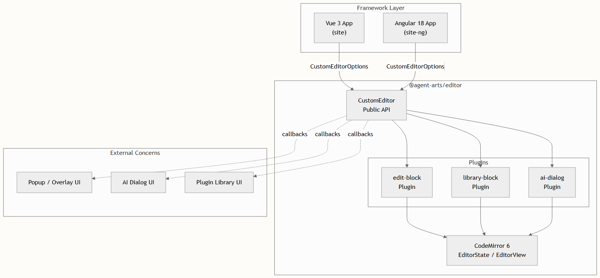
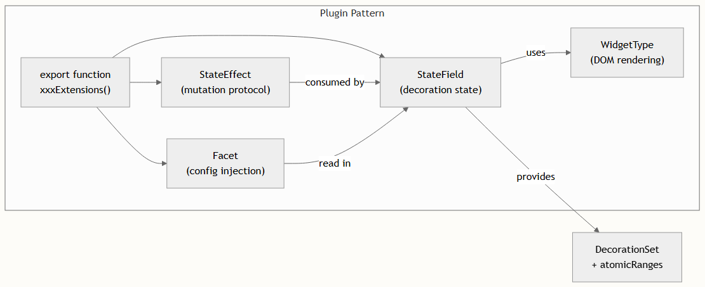
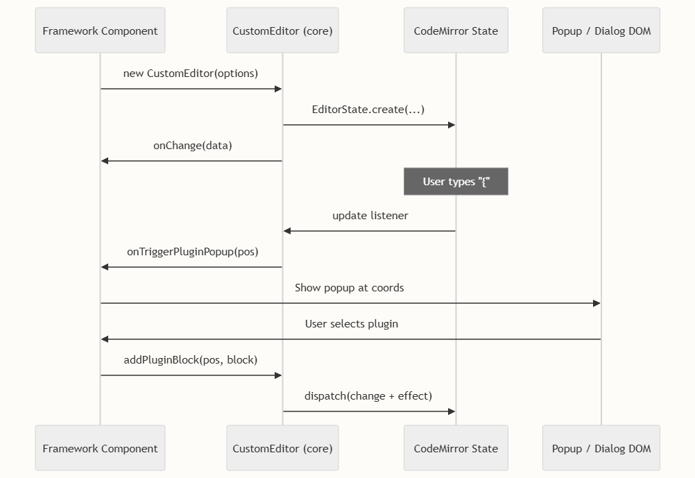
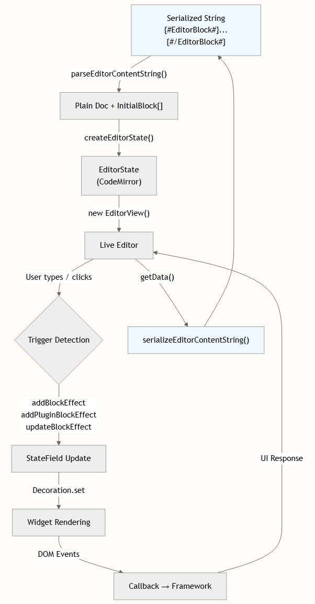

# 架构概述

本页介绍了 `@agent-arts/editor` 项目的高层架构——这是一个基于 CodeMirror 6 构建的提示词编辑器，专为 AI agent 场景设计。我们将探讨 monorepo 拓扑结构、插件驱动的核心引擎、块类型系统以及框架集成层，从而在深入各个子系统之前建立必要的思维模型。

## Monorepo 拓扑结构

本项目被组织为一个 **pnpm workspace monorepo**，包含三个包，每个包承担不同的架构角色。`pnpm-workspace.yaml` 中的工作区定义通过通配符匹配 `packages/**`，而根目录的 package.json 提供了编排脚本（`dev`、`build`、`build:ng`、`build:lib`），在开发过程中将这些包连接在一起。

```
project-root/
├── packages/
│   ├── core/          ← @agent-arts/editor (核心库)
│   ├── site/          ← Vue 3 演示应用
│   └── site-ng/       ← Angular 18 演示应用
├── pnpm-workspace.yaml
└── package.json       ← 编排脚本
```

依赖图严格向下流动：`site` 和 `site-ng` 都将 `@agent-arts/editor` 作为依赖项引入。核心包仅有三个生产依赖——`@codemirror/state`、`@codemirror/view` 和 `@codemirror/commands`——这使其运行时占用空间极小且不依赖任何框架。

| 包 | 角色 | 框架 | 核心依赖 |
| --- | --- | --- | --- |
| `@agent-arts/editor` | 编辑器库（已发布至 NPM） | 无（原生 TS） | — |
| `site` | 演示应用 | Vue 3 | `@agent-arts/editor` |
| `site-ng` | 演示应用 | Angular 18 | `@agent-arts/editor` |

核心包以 `@agent-arts/editor` v0.2.1 的名称发布到 npm，提供双格式 ESM/CJS 导出以及类型声明。这是唯一用于生产环境的包；`site` 和 `site-ng` 仅作为集成参考和开发沙箱。

## 系统架构

在最高层面上，编辑器遵循**回调委托架构**：核心引擎处理所有文档建模、块生命周期和文本操作，同时通过定义良好的 options/callback 接口，将所有视觉呈现问题（弹窗、对话框、覆盖层定位）委托给宿主框架。



**回调边界**是关键的架构接缝。`CustomEditor` 构造函数接受一个 `CustomEditorOptions` 对象，该对象定义了八个回调钩子——它们自身都不渲染 UI。相反，它们负责通知框架层显示/隐藏弹窗、处理块生命周期事件或流式传输 AI 响应。这种设计意味着核心引擎**完全不知道 Vue、Angular 或任何 UI 框架的存在**，使得集成面变得异常轻薄。

这三个插件是独立的 CodeMirror 扩展包。它们完全通过共享的 `EditorView` 实例进行相互通信——在 CodeMirror 状态模型之外，不存在任何直接的插件间导入或共享的可变状态。

## 核心引擎内部机制

核心引擎围绕一个单一的类——`CustomEditor`——构建，它封装了 CodeMirror 6 的` EditorView`，并为块操作和数据序列化暴露了精简的公共 API。

### 入口点与初始化

CustomEditor 构造函数执行三个阶段的初始化：

1. **内容解析** — 原始的 `initialDoc` 字符串（可能包含序列化的块标记，如 `{#EditorBlock ...#}`）由 `parseEditorContentString()`解析为一个带有 Unicode 对象替换字符（`\uFFFC`）占位符的纯文本文档，以及一个将位置映射到块元数据的 `InitialBlock` 描述符数组。

2. **状态创建** — `createEditorState()`使用组合的扩展集构建 CodeMirror `EditorState`：历史记录、键位映射、三个插件扩展、Markdown 样式和编辑器主题。块通过 `Facets` 被植入到它们各自的 `StateField` 中。

3. **视图挂载** — 创建 `EditorView` 时会附带额外的后置配置效果，这些效果用于连接变更监听器、剪贴板处理器（带有块序列化的复制/剪切/粘贴），并触发插件弹窗和 AI 对话框的扩展。

### 公共 API 层

`CustomEditor` 类暴露了七个公共方法，每个方法对应一个特定的编辑器操作：

| 方法	| 用途	| 机制 |
| --- | --- | --- |
| `addBlock()`	| 在光标处插入可编辑块	| 派发 `addBlockEffect` + 文本变更 |
| `addPluginBlock(pos, block)`	| 用插件块替换占位符	| 派发 `addPluginBlockEffect` + 文本变更 |
| `addVariableBlock(pos, name)`	| 插入 `{{name}}` 变量标记	| 直接文本变更（无 widget 效果） |
| `syncBlock(block)`	| 原地更新块元数据	| 派发 `updateBlockEffect` |
| `getBlock(id)`	| 通过 ID 检索块	| 从 `allBlocks` Map 中读取 |
| `getData()`	| 将整个文档序列化为字符串	| `serializeEditorContentString()` |
| `destroy()`	| 销毁编辑器视图	| `EditorView.destroy()` |

## 插件架构

每个插件遵循相同的架构模式：一个 `StateField`（或一组 StateFields）管理块装饰，`StateEffects` 定义用于变更的事务协议，而 `WidgetType` 子类则渲染替换文档中文本范围的 DOM 元素。



### 编辑块插件

编辑块插件（`edit-block.ts`）管理**可编辑的内联块**——即直接嵌入在编辑器文本流中的带蓝色边框的输入控件。每个 `EditorBlock` 携带一个 `id`、`placeholder` 和 `presetText`。`EditBlockWidget` 创建一个实时的 `<input>` 元素，该元素会根据内容宽度自动调整大小，并包含用于 `input`、`focus`、`click`、`mousedown` 和 `keydown` 的事件处理器，这些事件会通过 `CodeMirrorCallbacks` 接口回传委托。

三个 StateEffects 定义了变更协议：

- addBlockEffect — 在当前选区位置插入块
- addBlockAtEffect — 在特定文档位置插入块（用于粘贴/反序列化期间）
- updateBlockEffect — 用更新后的版本替换现有块的控件

### 资源库块插件

资源库块插件（`library-block.ts`）管理**只读的插件/工作流块**以及**变量标记**。插件块通过输入 `{` 触发，并渲染为带有特定类型 SVG 图标的绿色徽章。变量标记（`{{name}}`）通过正则表达式检测，并渲染为可编辑的内联输入框，允许重命名同时在光标导航期间保持为原子单元。

此插件维护两个独立的 `StateFields`：用于插件/工作流块的 `pluginBlockField`，以及用于 `{{变量}}` 标记的 `variableTokenField`。两者均被注册为 `atomicRanges` 提供者，确保光标将每个块视为单个字符。

### AI 对话框插件

AI 对话框插件（`ai-dialog.ts`）纯粹是一个**触发机制**——它检测两种激活模式并通知框架层：

- **斜杠触发** — 在任意位置输入 `/` 会触发 `onTriggerAIDialog(pos)`
- **选区触发** — 选中文本后会浮现一个闪烁按钮；点击它会触发 `onTriggerAIDialog(from)`

选区触发被实现为一个 `ViewPlugin`，它管理自己的 DOM 元素（一个 32×32 像素、定位于选区上方的按钮），并使用 `view.requestMeasure()` 进行高效的布局重新计算。该插件还处理关闭逻辑——删除 `/` 字符或 `{` 字符会通过 `onHideAIDialog`/`onHidePluginPopup` 隐藏相应的弹窗。

## 块类型系统

编辑器识别三种不同的块类型，每种类型在提示词编写工作流中承担不同的角色：

| 块类型	| 可编辑	| 插入触发方式	| 视觉样式	| 序列化标记 |
| --- | --- | --- | --- | --- |
| EditorBlock	| 是（内联输入）	| API 调用 addBlock()	| 蓝色边框，`rgba(20,118,255)`	| `{#EditorBlock id="..." placeholder="..."#}text{#/EditorBlock#}` |
| PluginBlock	| 否（只读徽章）	| 输入 `{` → 从弹窗中选择	| 绿色徽章，`rgba(2,153,49)`	| `{#PluginBlock id="..." type="plugin|workflow"#}name{#/PluginBlock#}` |
| Variable	| 是（可重命名的输入）	| 输入 `{{name}}` 或 API 调用	| 带样式的内联输入	| `{{name}}` (纯文本) |

所有块类型共享 Unicode 对象替换字符（`\uFFFC`）作为其在文档模型中的单字符占位符。这确保了光标移动、选区以及复制/粘贴都将块视为原子单元。core.ts 中的序列化层在导出时将这些占位符替换为它们的标记格式，而 core.ts 中的 parseEditorContentString() 在导入时逆转此过程——这使得序列化格式具有人类可读性且易于 diff。

感知剪贴板的序列化：CustomEditor 中的复制/剪切/粘贴处理器（core.ts）仅序列化选定范围。在粘贴时，系统会检测剪贴板文本中的序列化标记，并通过 addBlockAtEffect / addPluginBlockEffect 重建文档位置和相应的块装饰。这意味着块可以在不同的编辑器实例之间复制而不会丢失数据。

## 框架集成层

该架构明确地将编辑器逻辑（核心）与 UI 编排（框架层）分离。每个框架演示应用都实现了一组控制器类，将回调接口桥接到特定框架的响应式系统。

### 集成模式



### Vue 集成 (site)

Editor.vue 中的 Vue 集成遵循组合式 API 模式。它定义了三个本地控制器类——LocalLibraryBlockController、LocalAIDialogController 以及内联弹窗逻辑——这些类封装了编辑器回调，并管理用于可见性、定位和内容的 Vue ref() 状态。编辑器实例在 onMounted() 中创建，并通过 defineExpose() 暴露以供父组件访问。

### Angular 集成 (site-ng)

agent-prompt-editor.component.ts 中的 Angular 集成实现了 ControlValueAccessor，使编辑器可作为表单控件与 ngModel 或响应式表单配合使用。控制器类被提取到一个单独的 models 文件中（agent-prompt-editor.models.ts），并使用 ChangeDetectorRef.detectChanges() 进行手动变更检测，因为 CodeMirror 的变更发生在 Angular 的 zone 之外。该组件支持 ContentChild 模板引用，用于自定义编辑弹窗、插件弹窗和 AI 对话框。

控制器模式即集成契约：Vue 和 Angular 的实现都定义了相同的三个控制器类（LocalEditBlockController、LocalLibraryBlockController、LocalAIDialogController），并且具有相同的方法签名。如果你要集成到新的框架（React、Svelte 等），复现这些控制器是最可靠的途径——它们封装了核心回调所要求的定位计算和状态管理。

## 数据流总结

下图展示了编辑器数据的完整生命周期——从初始化到用户交互，再到序列化：



## 推荐阅读路径

现在你已经了解了整体架构的全貌，以下页面将逐步深入探讨各个子系统：

- CustomEditor 类 API — 公共 API 层、options 接口和方法签名的完整参考
- 块类型系统 — 深入探讨三种块类型、它们的控件实现及生命周期管理
- 内容序列化格式 — `{#EditorBlock#}` 和 `{#PluginBlock#}` 标记格式的规范，及解析/序列化算法
- StateField 和 StateEffect 模式 — CodeMirror 的响应式状态模型如何驱动块系统

如需特定框架的集成指南，请前往 Vue 集成 或 Angular 集成。