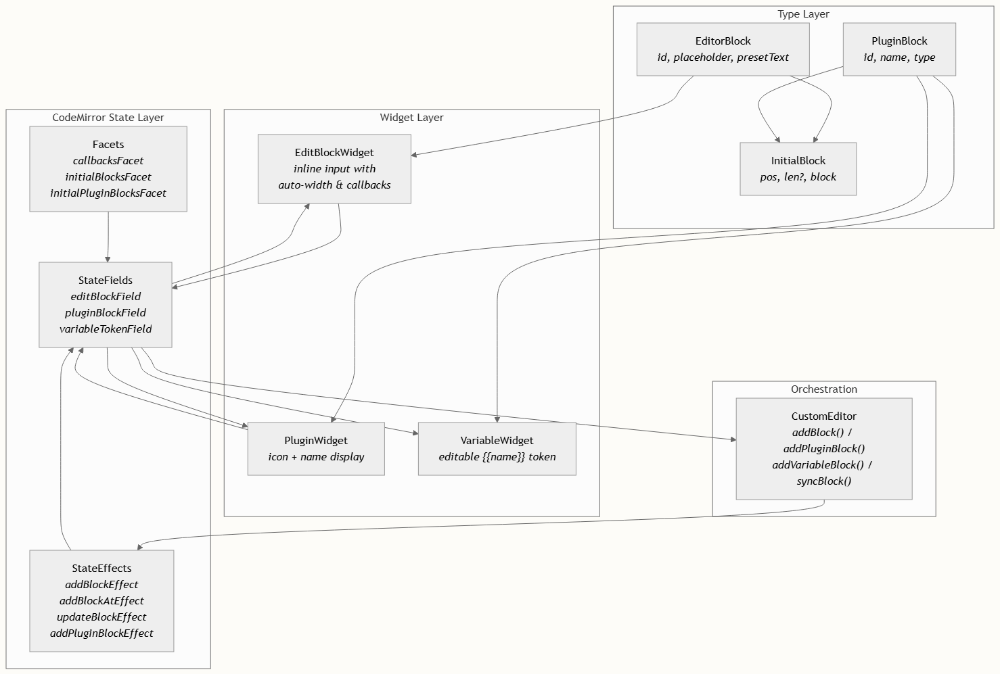
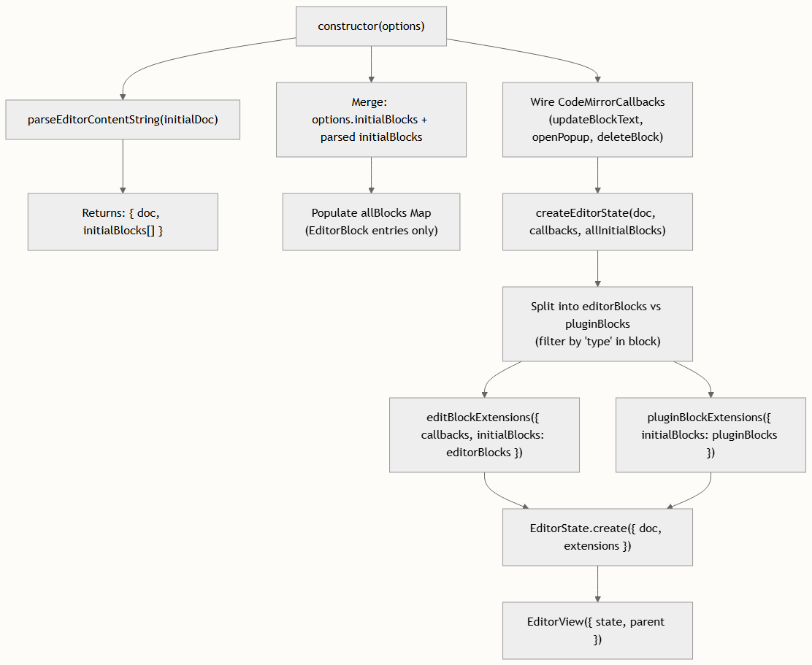

# Block 类型系统

块类型系统是 agent-arts/editor 的架构骨干。它定义了非文本交互元素（可编辑字段、库引用和模板变量）如何内联嵌入到 CodeMirror 6 文档中，如何作为原子部件（Widget）进行渲染，以及如何通过 TypeScript 接口、CodeMirror StateEffects、StateFields 和 Facets 的严谨组合来管理其生命周期。对于任何希望通过新的块行为来扩展编辑器，或将其集成到宿主应用中的开发者来说，理解此系统至关重要。


核心类型定义
整个块层级结构根植于 types.ts 中定义的两个接口。这些是块的消费者唯一需要理解的数据契约——它们描述了块在静态时的形态，独立于任何 CodeMirror 机制。

```typescript
export interface EditorBlock {
  id: string;
  placeholder: string;
  presetText: string;
}
 
export interface PluginBlock {
  id: string;
  name: string;
  type: 'plugin' | 'workflow' | 'variable';
}
```

EditorBlock 表示一个内联可编辑的输入字段。每个实例携带一个唯一的 id、字段为空时显示的 placeholder，以及保存当前用户输入值的 presetText。这些块是在其他静态内容中暴露可由用户编辑插槽的主要机制。

PluginBlock 表示对外部实体（插件、工作流或模板变量）的引用。type 鉴别器不仅决定了它的视觉外观（plugin 和 workflow 使用不同的 SVG 图标），还决定了它的行为语义（变量块使用内联的 `{{name}}` 标记语法，而非部件替换）。

这两种类型通过 InitialBlock 类型统一到单一的位置信封中，该信封除了块的有效载荷外，还携带了文档位置（pos）和可选的字符长度（len）：

```typescript
export type InitialBlock = {
  pos: number;
  len?: number;
  block: EditorBlock | PluginBlock;
};
```

这个信封是传递给编辑器初始化管道和序列化系统的通用货币，确保块数据及其位置锚点始终结伴而行。EditorBlock 和 PluginBlock 之间的区别在运行时通过检查 type 字段是否存在来检测——参见 createEditorState，其中通过对 initialBlocks 执行 'type' in b.block 检查来进行拆分。


块架构概览
块系统遵循分层架构，其中类型定义位于底层，CodeMirror 状态原语处理生命周期变更，WidgetType 子类提供 DOM 渲染，而 CustomEditor 类通过统一的公共 API 编排这一切。



每个垂直层都具有单一职责。类型层是纯数据；它对 CodeMirror 一无所知。状态层管理块装饰的事务性变更。部件层拥有 DOM 创建和事件处理。编排层（即 CustomEditor 类）提供了供框架集成调用的唯一公共 API 表面。


两种块族对比

尽管 EditorBlock 和 PluginBlock 共享相同的 InitialBlock 信封，但它们在可变性、渲染策略和生命周期管理方面有着根本的不同。下表捕捉了这些区别：

| 维度	| EditorBlock	| PluginBlock (plugin / workflow)	| PluginBlock (variable)|
| --- | --- | --- | --- |
| 接口	| EditorBlock	| PluginBlock	| PluginBlock|
| 可变内容	| 是 — presetText	| 否 — name 仅用于展示	| 是 — `{{name}}` 标记可内联编辑|
| 部件类	| EditBlockWidget	| PluginWidget	| VariableWidget|
| StateField	| editBlockField	| pluginBlockField	| variableTokenField|
| StateEffects	| addBlockEffect, addBlockAtEffect, updateBlockEffect	| addPluginBlockEffect	| 通过 view.dispatch 直接变更文本|
| 发现机制	| 文档正则匹配：`variableTokenRegex = /\{\{(.+?)\}\}/g`	| 不适用	| 不适用|
| 内联编辑	| 带占位符的自动宽度 `<input>`	| 无 — 点击触发弹出层	| 带有 `{{变量}}` 语法的自动宽度 `<input>`|
| 删除行为	| 在空输入上按退格键移除块	| 由 core 中的 deleteBlock 处理	| 在边界处按退格/删除键移除标记|
| 在 allBlocks 中追踪	| 是 — `Map<string, EditorBlock>`	| 否	| 否|
| 序列化格式	| `{#EditorBlock id="..." placeholder="..."#}text{#/EditorBlock#}`	| `{#PluginBlock id="..." type="..."#}name{#/PluginBlock#}`	| 纯 `{{name}}` 文本（无标签）|

关键的不对称性在于，只有 EditorBlock 实例会在 CustomEditor.allBlocks 映射中被追踪。插件块和变量块纯粹从其在文档中的序列化位置进行渲染——它们的状态存在于 DOM 部件或文档文本本身中，而不是在一个单独的存储中。这种设计选择意味着 EditorBlock 的值能够在重新渲染中存活下来，并可以通过 syncBlock() 进行外部同步，而插件块则是位置依赖的，并在每次解析时从文档中恢复其状态。


EditorBlock：可变的内联输入
EditorBlock 是编辑器中主要的交互元素。它们渲染为内联的 `<input>` 元素，会自动调整大小以适应内容宽度，支持占位符文本，并与编辑器的弹出层和回调系统深度集成。

部件渲染
EditBlockWidget 继承自 CodeMirror 的 WidgetType，并在 toDOM 方法中构建其 DOM。该部件创建了一个带有 data-block-id 属性（用于外部识别）的 `<span class="cm-inline-block">` 容器，然后附加一个带样式的 `<input>` 元素。输入的值从 block.presetText 初始化，其宽度通过使用镜像字体指标的隐藏测量 `<span>` 进行动态测量。

```typescript
const measureWidth = (val: string) => {
  const temp = document.createElement('span');
  temp.style.visibility = 'hidden';
  temp.style.position = 'absolute';
  temp.style.whiteSpace = 'pre';
  temp.style.font = 'inherit';
  temp.textContent = val || input.placeholder;
  document.body.appendChild(temp);
  const width = temp.offsetWidth;
  document.body.removeChild(temp);
  return width + 10;
};
```

这种自动宽度测量在每次 input 事件时触发，确保部件在用户输入或删除内容时能够流畅地扩展和收缩。


回调集成

每个 EditBlockWidget 都会接收一个 CodeMirrorCallbacks 对象，通过该对象将生命周期事件传递给 CustomEditor：

| 回调	| 触发时机	|效果|
| --- | --- | --- |
| updateBlockText(id, text)	| 每次击键 (oninput)	| 更新 allBlocks 映射中的 presetText 并触发 onBlockUpdated 选项|
| openPopup(id, rect)	| 输入框 focus 或 click	| 触发 onOpenPopup 选项，附带块的边界矩形用于 UI 定位|
| deleteBlock(id)	| 输入为空时的 Backspace	| 从 allBlocks 映射中移除块，删除文档范围，触发 onBlockDeleted 选项|

这些回调通过 CodeMirror Facet 注入，允许根据上下文对同一个无状态部件类进行不同的配置。CustomEditor 构造函数在 core.ts 的第 56–76 行将这些回调连接到其内部的 state 管理。

`EditBlockWidget` 上的 `ignoreEvent()` 重写返回 `true`，告诉 CodeMirror **不要**处理落在部件 DOM 上的鼠标和键盘事件。正是这一点使得嵌入的 `
` 能够正常捕获击键——如果没有这个重写，CodeMirror 会拦截每一次按键，导致输入框无法工作。


用于变更的 StateEffects
三个 StateEffects 管理 EditorBlock 的生命周期，均定义在 edit-block.ts 中：

| StateEffect	| 值类型	| 用途|
| --- | --- | --- |
| addBlockEffect	| EditorBlock	| 在当前光标位置（光标 − 1）插入块|
| addBlockAtEffect	| { pos, len?, block }	| 在显式的文档位置插入块|
| updateBlockEffect	| EditorBlock	| 替换现有的块部件（通过 id 匹配）|

editBlockField StateField 在其 update 方法中处理这些 effects。对于 addBlockEffect，块被放置在 selection.main.head - 1 处，因为文档变更（插入 BLOCK_PLACEHOLDER）已经将光标向前移动了一个字符。对于 updateBlockEffect，该字段会对现有装饰进行全量扫描，以通过 id 找到匹配的块，移除旧装饰，并插入带有更新部件的新装饰。


PluginBlock：不可变引用与变量标记
PluginBlock 根据其 type 字段分为两个不同的渲染路径。plugin 和 workflow 类型共享一个 PluginWidget 渲染器，而 variable 类型则使用由正则表达式驱动的 VariableWidget 系统。

插件和工作流部件
PluginWidget 渲染一个紧凑的内联元素，包含一个 SVG 图标（plugin 和 workflow 的图标不同，分别来源于 svgPlugin 和 svgWorkflow），其后跟着作为文本节点的块 name。这些部件是纯展示型的——它们不接受键盘输入，也没有内置的交互处理程序。点击行为由插件弹出层触发扩展在外部进行管理。

插件块专门通过 addPluginBlockEffect 添加，该 effect 携带目标位置和完整的 PluginBlock 对象。pluginBlockField 在创建时过滤掉 variable 类型的块，仅将 plugin 和 workflow 实例发送给 PluginWidget。

variable 类型的 PluginBlock 对象会被 pluginBlockField 静默忽略——在第 172 行的 if (block.type === 'variable') return null 检查确保它们永远不会接收到 PluginWidget。相反，变量是由独立的 variableTokenField 根据对原始文档文本的正则模式匹配来发现和渲染的。


变量标记系统
变量块代表了一种与其他两种块类型根本不同的方法。变量不是通过 StateEffects 和具有已知块实例集的 StateField 来追踪的，而是通过在第 45 行使用正则表达式 `/\{\{(.+?)\}\}/g` 从文档文本中动态发现的。

variableTokenField 在每次变更时重新扫描整个文档，为每个匹配项创建 VariableWidget 实例。每个部件渲染一个预填了 `{{name}}` 标记的可编辑 `<input>`，允许用户就地修改变量名。在失去焦点时，该部件会派发一个文本变更，用新值替换旧标记。

这种设计意味着变量块在文档变更之间没有持久的身份。与 EditorBlock（通过 id 在 allBlocks 中追踪）或 plugin/workflow 块（作为装饰维护在 pluginBlockField 中）不同，变量的生命周期完全由文本驱动。一个被删除的 `{{name}}` 标记即告消亡；一个新输入的 `{{name}}` 标记会在下一次文档变更时突然出现。

该系统还谨慎地处理了删除操作。pluginBlockExtensions 函数注册了 keydown 和 beforeinput 处理程序，用于检测退格键或删除键何时会与变量标记边界发生冲突，并以原子方式移除整个标记，从而防止出现部分删除。


块的公共 API
CustomEditor 类公开了五个用于块操作的方法。这些是框架集成在以编程方式与块交互时应使用的唯一入口点。

方法参考

| 方法	| 签名	|描述|
| --- | --- | --- |
| addBlock()	| () => EditorBlock	| 创建一个带有随机 ID 的新 EditorBlock，在光标处插入 BLOCK_PLACEHOLDER，派发 addBlockEffect，返回该块|
| addPluginBlock(pos, block)	| (pos: number, block: PluginBlock) => PluginBlock	| 将 pos 处的字符替换为 BLOCK_PLACEHOLDER，派发 addPluginBlockEffect|
| addVariableBlock(pos, name)	| (pos: number, name: string) => PluginBlock	| 将 pos 处的字符直接替换为 `{{name}}` 文本（无 StateEffect）|
| syncBlock(updatedBlock)	| (updatedBlock: EditorBlock) => void	| 更新 allBlocks 映射并派发 updateBlockEffect 以重新渲染部件|
| getBlock(id)	| (id: string) => EditorBlock | undefined	| 从 allBlocks 映射中读取当前块状态|

请注意其中的不对称性：addPluginBlock 和 addVariableBlock 都需要一个显式的 pos 参数（通常是刚刚由插件弹出系统插入的 BLOCK_PLACEHOLDER 的位置），而 addBlock 使用的是当前光标位置。这反映了不同的用户体验流程——编辑器块由用户在光标处添加，而插件块则放置在由弹出菜单确定的特定插入点。


块初始化流程
当使用已有的序列化内容构造 CustomEditor 时，块会经过一个多阶段的初始化管道，该管道负责协调文档文本、块元数据和 CodeMirror 状态。



parseEditorContentString 函数在原始内容中扫描 {#EditorBlock ...#}...{#/EditorBlock#} 和 {#PluginBlock ...#}...{#/PluginBlock#} 标签对，从属性和内部文本中提取块元数据。每个匹配的块在文档中将其标签对替换为单个 BLOCK_PLACEHOLDER 字符 (\uFFFC)，并将块数据连同其位置偏移量记录在 initialBlocks 数组中。

createEditorState 函数随后对这些块进行分类：那些没有 type 属性的块成为用于 editBlockExtensions 的 EditorBlock 条目，而那些带有 type（不包括 variable）的块成为用于 pluginBlockExtensions 的 PluginBlock 条目。变量块由 variableTokenField 对文档文本的正则扫描隐式处理。


剪贴板与序列化
块通过将块元数据直接嵌入文本的自定义序列化格式参与到编辑器的复制/粘贴系统中。当用户复制包含块的选区时，serializeEditorContentSlice 会将每个块的占位符字符替换为其完整的标签表示形式。在粘贴时，parseEditorContentString 会逆转此过程，同时恢复文档文本和块装饰。

CustomEditor 构造函数中的粘贴处理程序（第 109–139 行）会在启用支持块的粘贴路径之前，检查剪贴板文本中是否存在 {#EditorBlock 或 {#PluginBlock 标记。对于每个解析出的块，它会派发相应的 StateEffect（addBlockAtEffect 或 addPluginBlockEffect），以便在正确的位置连接部件装饰。在粘贴过程中发现的 EditorBlock 也会被注册到 allBlocks 映射中，以确保回调的连续性。

全文档序列化（serializeEditorContentString）遵循相同的替换策略，并通过公共的 getData() 方法公开，该方法将完整的编辑器内容作为单个 EditorData 字符串返回，适用于持久化或网络传输。


要深入了解块是如何连接到编辑器公共表面的，请继续阅读 CustomEditor 类 API。要查看块序列化格式的详细结构，请转到 内容序列化格式。关于管理块扩展的插件级模式，请参阅 编辑块插件 和 库块插件。