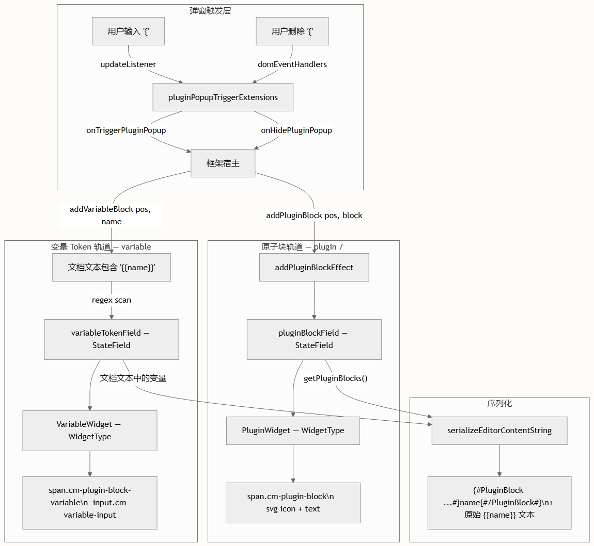

# 组件库 Block 插件

Library Block 插件为编辑器提供了一种机制，用于将插件引用、工作流引用和模板变量直接嵌入到文档内容中。与Edit Block 插件（用于创建内联可编辑区域）不同，Library Block 代表外部实体，它们被渲染为原子的、不可编辑的内联小部件。该插件是编辑器可扩展性模型的骨干，允许用户组合提示词模板，将自由格式的文本与对外部工具的结构化引用及动态数据槽混合在一起。

## 插件块类型系统

插件系统围绕 PluginBlock 类型展开，该类型定义了三个不同的块类别，它们共享一个通用接口，但在渲染行为和文档生命周期上有所不同。每种类型都映射到编辑器中特定的可视化和交互模型。

|属性	|类型	|描述|
|--|--|--|
|id	|string	|块实例的唯一标识符|
|name	|string	|显示名称（例如 "MCP服务01"、"Bing搜索"）或变量名|
|type	|'plugin' \| 'workflow' \| 'variable'	|控制渲染和生命周期的判别属性|

三种 type 变体划分了清晰的行为边界：plugin 和 workflow 块通过 pluginBlockField StateField 进行管理，并通过 PluginWidget 类渲染为“图标+文本”小部件；而 variable 块则遵循完全不同的路径——它们作为原始的 `{{name}}` 文本存在于文档中，由 variableTokenField StateField 动态检测，然后通过 VariableWidget 类渲染为可编辑的输入字段。


这种拆分并非随意为之。Plugin 和 workflow 块是通过 addPluginBlockEffect StateEffect 原子性地插入的，它们会用占位符（`\uFFFC`）替换文档中的某个位置，并叠加一个小部件装饰。相比之下，Variable 是从文本中解析出来的——它们的 `{{变量}}` 语法直接存在于文档字符串中，这使得它们在跨越序列化边界时具有可移植性，而无需特殊的标记。

## 架构概览

下图说明了这两条渲染管道及其与编辑器状态管理层的关系。关键的架构洞察在于，Library Block 并非一个单体系统——它们被分解为两条独立的 StateField 轨道，这两条轨道共享一个通用的触发机制，但在其他方面是并行运行的。



## 原子性 Plugin 与 Workflow 块

### PluginWidget 渲染

PluginWidget 类扩展了 CodeMirror 的 WidgetType，用于生成内联 DOM 元素，这些元素将块的标识显示为带有样式的徽章。该小部件的 toDOM 方法会构建一个带有 cm-plugin-block 类以及特定类型修饰符（cm-plugin-block-plugin 或 cm-plugin-block-workflow）的 `<span>`。每个非变量块都会接收一个内联 SVG 图标——要么是 svgPlugin（拼图图标），要么是 svgWorkflow（流程图图标）——其后跟作为文本节点的块 name。关键细节在于 ignoreEvent 返回 true，这使得这些小部件具有原子性：光标无法进入其中，且键盘事件会直接穿透而不会被消耗。


### StateField: pluginBlockField

pluginBlockField StateField 管理着一个 DecorationSet，用于跟踪文档中所有非变量的插件块。在初始化期间，它会读取 initialPluginBlocksFacet——一个接受 `{ pos, len?, block }` 描述符数组的 Facet——按位置对它们进行排序，并创建 Decoration.replace 条目，用 PluginWidget 实例替换底层文本字符。provide 子句至关重要：它不仅将装饰集注册到 EditorView.decorations 中，还将每个小部件的范围标记为 atomicRange，从而防止光标被定位在装饰内部。


在文档发生更改时，更新逻辑会执行两个操作。首先，它会过滤掉范围与任何更改区域重叠的装饰——当块周围的文本被删除时，这会自动移除这些块。其次，它通过事务的更改集映射所有存活的装饰，以保持位置同步。此外，事务中的任何 addPluginBlockEffect 值都会被应用，在指定位置插入新的小部件装饰。

### 动态添加块

addPluginBlockEffect StateEffect 是用于在运行时插入 plugin/workflow 块的命令式 API。当宿主框架调用 CustomEditor.addPluginBlock(pos, block) 时，它会派发一个事务，将 pos 处的一个字符替换为 Unicode 对象替换字符（`\uFFFC`）并附加该 effect。pluginBlockField 的更新处理器会检测到此 effect，通过更改映射位置，并创建小部件装饰。

```typescript
// 来自 CustomEditor — 宿主 API 层
public addPluginBlock(pos: number, block: PluginBlock) {
  this.view.dispatch({
    changes: { from: pos, to: pos + 1, insert: BLOCK_PLACEHOLDER },
    effects: addPluginBlockEffect.of({ pos, block }),
    selection: { anchor: pos + 1 }
  });
  this.view.focus();
  return block;
}
```

> 当省略 addPluginBlockEffect 中的 len 参数时，其默认值为 1，这与 CustomEditor.addPluginBlock 中插入单个字符占位符的操作相匹配。这个默认值是安全的，因为在创建装饰之前，effect 的位置会通过事务的更改集进行映射，因此它始终引用更改后的坐标空间。

## 模板变量

### 检测与渲染

与 plugin/workflow 块相比，变量占据了一个根本不同的架构位置。它们不是作为独立的状态实体被跟踪，而是通过使用正则表达式 `/\{\{(.+?)\}\}/g` 扫描文档文本来检测 `{{name}}` 模式。variableTokenField StateField 在每次更改时都会执行全文档扫描，创建 Decoration.replace 条目，将每个匹配的 token 替换为 VariableWidget 实例。


VariableWidget 是插件系统中最复杂的小部件。它渲染一个 `<input>` 元素，该元素预填充了变量 token（例如 `{{user_name}}`），并通过 `.cm-variable-input` 主题类进行样式设置，使其在视觉上与周围文本无法区分。通过堆叠多个事件处理层来实现所需的行为：

| 事件处理器	|用途|
| input.mousedown / input.keydown	|stopPropagation() —— 防止编辑器在输入框处于活动状态时拦截焦点和按键|
| span.mousedown	|preventDefault() + stopPropagation() —— 捕获对小部件容器的点击，并以编程方式聚焦/选中输入框|
| input.input	|使用一个隐藏的测量 `<span>` 动态调整输入框宽度，该元素能镜像当前值的文本尺寸|
| input.blur	|失去焦点时，派发一个事务，用输入框的当前值替换文档中的旧 token 文本，然后将焦点返回给编辑器|

VariableWidget 上的 eq 方法会对 name 和 tokenLength 执行浅比较。这对于 CodeMirror 的小部件回收机制至关重要——如果同一位置的两个小部件具有相同的标识，CodeMirror 会重用现有的 DOM 节点而不是重新创建它，从而保留用户正在进行的编辑。

> `variableTokenField` 也被注册为 `atomicRange` 提供者，这意味着光标无法被放置在变量 token 内部。然而，`VariableWidget` 内部的 `
` 元素通过 `stopPropagation()` 捕获了 `mousedown` 和 `keydown` 事件，有效地创建了一个对 CodeMirror 自身状态管理不可见的局部编辑上下文。这种双层隔离正是实现变量原地重命名的关键。

### 变量删除处理

因为变量是覆盖文本范围的装饰，而不是独立的状态对象，所以删除操作需要显式的协调。pluginBlockExtensions 函数为 keydown（涵盖退格键/删除键）和 beforeinput（涵盖移动浏览器的 deleteContentBackward/deleteContentForward 输入类型）注册了 DOM 事件处理器。当检测到光标相邻于变量范围时，这些处理器会派发一个事务，原子性地删除整个变量 token，而不是允许 CodeMirror 逐个字符地删除。两个辅助函数——findVariableEndingAt 和 findVariableStartingAt——会查询 variableTokenField 以定位特定边界位置上的装饰。

## 弹窗触发系统

弹窗触发机制是用户意图与 Library Block 选择 UI 之间的桥梁。pluginPopupTriggerExtensions 函数返回两个 CodeMirror 扩展，它们共同实现了一个基于字符的触发器

- EditorView.updateListener：监听每一次文档更改。当插入单个 { 字符时，它会带上插入位置调用 onTriggerPluginPopup(fromA)。如果某个更改删除了 { 而没有插入 {，它就会调用 onHidePluginPopup()。
- EditorView.domEventHandlers：处理 keydown 和 beforeinput 事件，以检测用户何时删除了 { 字符（无论是作为选区的一部分还是在光标边界处），并调用 onHidePluginPopup() 以关闭选择 UI。

传递给 onTriggerPluginPopup 的触发位置是一个原始的文档位置——宿主框架负责使用 view.coordsAtPos(pos) 将其转换为屏幕坐标，并相对于编辑器容器定位弹窗面板。这种关注点分离使得核心插件免于处理 DOM 布局逻辑。

## 序列化格式
Plugin 和 workflow 块使用基于自定义标签的格式进行序列化，该格式将块元数据作为属性嵌入，并将块的显示名称作为内部文本。然而，变量被序列化为纯文本——它们的 `{{name}}` 语法本身就是序列化格式。


### Plugin/Workflow 块序列化

```
{#PluginBlock id="<escaped_id>" type="plugin|workflow"#}<block_name>{#/PluginBlock#}
```

serializeEditorContentString 函数通过 getPluginBlocks(view) 收集所有非变量的插件块，并将每个块的文档范围替换为带标签的格式。属性值使用 escapeAttrValue 进行转义，该函数处理反斜杠、引号和控制字符。

### 变量序列化

变量不需要特殊的序列化——它们作为字面量 `{{name}}` 字符串保留在文档文本中。可以使用 parseTemplateVariables 工具函数，通过扫描 `{{变量}}` 模式从序列化字符串中重建变量块元数据，尽管这主要用于模板分析，而不是在正常的编辑器初始化期间使用。

### 反序列化

core.ts 中的 parseEditorContentString 函数在文档初始化期间处理 {#EditorBlock...#} 和 {#PluginBlock...#} 标签。对于 PluginBlock 标签，它会提取 id 和 type 属性，使用内部文本作为块名称，并创建一个 PluginBlock 对象，如果类型不是 'workflow'，则默认为 'plugin'。值得注意的是，createEditorState 中的反序列化管道会从插件块数组中过滤掉变量类型的块——变量不会作为装饰进行预注册，因为 variableTokenField 会自动从文档文本中检测到它们。

| 序列化形式	| 块类型	| 反序列化路径 |
| `{#PluginBlock id="..." type="plugin"#}name{#/PluginBlock#}`	| Plugin	| parseEditorContentString → initialPluginBlocksFacet → pluginBlockField |
| `{#PluginBlock id="..." type="workflow"#}name{#/PluginBlock#}`	| Workflow	| parseEditorContentString → initialPluginBlocksFacet → pluginBlockField |
| `{{variable_name}}` (原始文本)	| Variable	| 初始化时由 variableTokenField 进行正则扫描 |

## 公共 API 参考

Library Block 插件从 library-block.ts 导出以下公共成员：

类型

| 导出项	|类型	|描述|
| LibraryBlockCallbacks	|interface	|用于带有屏幕坐标的弹窗显示/隐藏的回调契约|
| addPluginBlockEffect	|StateEffect	|用于插入 plugin/workflow 块的命令式 effect|

扩展函数

|导出项	|签名	|描述|
| pluginBlockExtensions	|(options: { initialBlocks?: ... }) => Extension[]	|核心扩展：StateFields、主题、变量删除处理器|
| pluginPopupTriggerExtensions	|(options: { onTriggerPluginPopup, onHidePluginPopup? }) => Extension[]	|用于弹窗显示/隐藏的字符触发检测|

工具函数

|导出项	|签名	|描述|
| getPluginBlocks	|(view: EditorView) => { pos, len?, block }[]	|从当前视图状态中提取所有非变量的插件块|
| parseTemplateVariables	|(doc: string) => { pos, len, block }[]	|将字符串中的 `{{变量}}` token 解析为 PluginBlock 描述符|

## 集成模式（Vue 示例）

Vue 集成站点演示了 Library Block 系统的完整集成。宿主应用程序实例化一个 LocalLibraryBlockController，将可用的插件、工作流和变量封装为数据数组，以及触发位置状态。控制器的 show 方法将相对于编辑器的坐标（来自 view.coordsAtPos）转换为相对于容器的 CSS 定位。当用户从弹窗中选择一个项目时，宿主会调用 editor.addPluginBlock(pos, item) 或 editor.addVariableBlock(pos, name)——这两者都是 CustomEditor 类上的方法，用于将相应的事务派发到编辑器状态中。

CustomEditorOptions 接口专门为 Library Block 触发系统需要两个回调：当用户输入 { 时触发 onTriggerPluginPopup: (pos: number) => void，当删除 { 时触发可选的 onHidePluginPopup: () => void。这些回调在编辑器构建期间被接入到 pluginPopupTriggerExtensions 中。

## 与其他插件的关系

与同类插件相比，Library Block 插件在编辑器的插件架构中占据了一个独特的层级。理解这些边界有助于明确职责所在，以及针对特定用例应该扩展哪个插件。

|方面	|Library Block 插件|	Edit Block 插件|	AI Dialog 插件|
| 触发字符	| {	仅限编程方式	| /
| 块数据类型	| PluginBlock (外部引用)	| EditorBlock (可编辑内容)	| 不适用 (文本替换)
| 小部件基类	| PluginWidget / VariableWidget	| EditBlockWidget	| 不适用
| 序列化标签	| {#PluginBlock#}	| {#EditorBlock#}	| 不适用
| 状态管理	| pluginBlockField + variableTokenField	| editBlockField	| ViewPlugin

如需深入理解作为 Library Block 和 Edit Block 插件基础的 StateField 和 StateEffect 模式，请参阅 StateField 和 StateEffect 模式。