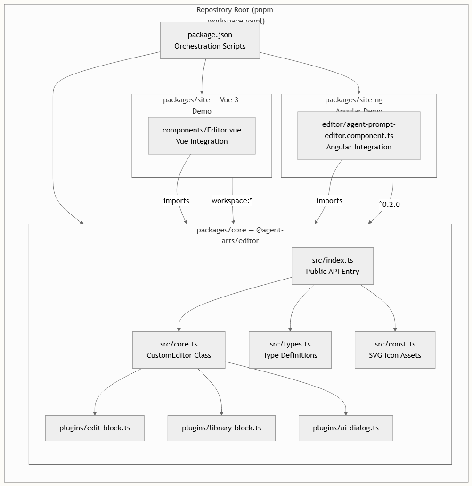
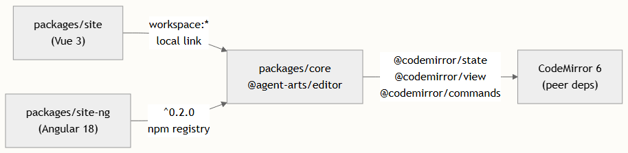

# Monorepo 目录结构

本项目采用 **pnpm workspace 单体仓库** 组织，包含三个协同工作的独立包，旨在提供一个不依赖特定框架的提示词编辑器，并附带开箱即用的框架演示。在深入各个包之前，理解此布局至关重要——它能帮你厘清编辑器核心逻辑与框架特定胶水代码的归属。

## Workspace 架构

该单体仓库由 pnpm workspaces 管理，通过仓库根目录下的单一声明文件进行配置。所有包均位于 `packages/` 目录下，pnpm 会在开发期间自动解析跨包依赖并将它们链接在一起。



工作区配置极简且精准——它使用 glob 模式 `packages/**` 来发现所有包。这意味着未来在 `packages/` 下新增的任何包都会被 pnpm 自动识别，无需额外配置。

## 包概览

该单体仓库恰好包含三个包，各自职责分明。核心库承载所有编辑器逻辑且不依赖特定框架，而两个站点包则是面向用户的演示应用，分别展示了与 Vue 3 和 Angular 的集成模式。

| 包	| 目录	| NPM 名称	| 用途	| 构建工具 |
| --- | --- | --- | --- | --- |
| 核心编辑器	| packages/core	| @agent-arts/editor	| 不依赖特定框架的提示词编辑器库	| Vite (library 模式) |
| Vue 站点	| packages/site	| site (私有)	| Vue 3 集成演示	| Vite + UnoCSS |
| Angular 站点	| packages/site-ng	| site-ng (私有)	| Angular 18 集成演示	| Angular CLI |

## 根级编排

根目录下的 `package.json` 作为整个单体仓库的指挥中心。它不包含应用代码，而是定义了编排脚本，利用 `concurrently` 工具协调各包的构建与开发服务器。这让你只需一条命令即可启动完整的开发环境。

| 脚本	| 作用 |
| --- | --- |
| pnpm dev	| 同时以监听模式启动核心库并启动 Vue 站点开发服务器 |
| pnpm dev:ng	| 先构建一次核心库，然后启动核心监听模式并启动 Angular 开发服务器 |
| pnpm build	| 构建用于生产环境的 Vue 站点 |
| pnpm build:ng	| 构建用于生产环境的 Angular 站点 |
| pnpm build:lib	| 仅构建 @agent-arts/editor 库 |
| pnpm build:watch	| 以监听模式构建核心库（文件变更时重新构建） |

> 注意这里使用了 `pnpm -F`（filter）语法——`pnpm -F site dev` 仅在 `site` 包内运行 `dev` 脚本，同理 `pnpm -F @agent-arts/editor build` 通过其发布的包名精准定位核心库。这种过滤机制是 pnpm workspaces 的核心特性，支持精确执行针对单个包的命令。

## 核心包 — packages/core

这是单体仓库的核心。名为 `@agent-arts/editor`，它是一个**已发布的 npm 包**，将所有编辑器功能封装为一个不依赖特定框架的 TypeScript 库，基于 CodeMirror 6 构建。该包使用 Vite 的库模式构建，同时生成 ES module 和 UMD 输出，并附带打包后的类型声明 packages/core/vite.config.ts。

### 源码结构

```
packages/core/src/
├── index.ts          ├── core.ts           # CustomEditor class — main entry point
├── types.ts          # EditorBlock, PluginBlock, EditorData type definitions
├── const.ts          # SVG icon constants for plugin/workflow icons
└── plugins/
    ├── edit-block.ts    # Edit block plugin (editable blocks)
    ├── library-block.ts # Library block plugin (insertable plugins/workflows/variables)
    └── ai-dialog.ts     # AI dialog plugin (slash-command and text-selection triggered)
```

公共 API 接口刻意设计得很窄——`index.ts` 从 `core.ts` 和 `types.ts` 中重新导出所有内容。这意味着使用者直接从 `@agent-arts/editor` 导入，即可获得 `CustomEditor` 类及所有必要的类型定义。这三个插件不作为公共 API 直接导出——它们由 `CustomEditor` 内部消费，并通过基于回调的选项暴露。

> 核心库通过 Rollup 的 external 配置将 CodeMirror 依赖（`@codemirror/state`、`@codemirror/view`、`@codemirror/commands`）外部化。这意味着使用者必须安装这些对等依赖，但这保持了包的精简并避免了版本冲突。

### 构建产物

Vite 库构建会同时生成两种格式，配置位于 `packages/core/vite.config.ts`：

| 格式	| 文件	| 模块系统	| 使用场景 |
| --- | --- | --- | --- |
| ES	| dist/editor.js	| ESM import	| 现代打包工具（Vite、webpack、Angular） |
| UMD	| dist/editor.umd.cjs	| CommonJS / `<script>`	| Node.js 或传统环境 |
| 类型	| dist/index.d.ts	| TypeScript 声明	| IDE 智能提示、类型检查 |

## 站点包 — packages/site

Vue 3 演示应用位于 `packages/site`，演示了如何将 `@agent-arts/editor` 集成到 Vue 3 应用中。它被标记为 private，不会发布到 npm——其唯一用途是作为可运行的演示和参考实现。

### 核心集成细节

该站点使用 pnpm workspace 协议 `"@agent-arts/editor": "workspace:*"` 消费核心库。这告诉 pnpm 在开发期间直接链接到本地的 packages/core 目录，因此对核心库的任何更改都会立即反映在 Vue 站点中，无需重新安装。在发布时，pnpm 会自动将 workspace:* 解析为实际的版本号。

主要的集成点是 components/Editor.vue，它实例化 CustomEditor 并管理弹出控制器的生命周期（用于编辑块、插件块和 AI 对话）。该组件使用 Vue 3 组合式 API（`<script setup>`）配合响应式 ref 来管理弹出层的可见性和定位。

## Site-NG 包 — packages/site-ng

位于 packages/site-ng 的 Angular 演示应用展示了同一个编辑器在 Angular 18 中的集成。与 Vue 站点不同，它引用的是已发布的 npm 包 `"@agent-arts/editor": "^0.2.0"`，而不是使用 workspace 协议，这意味着它指向的是注册表版本而非本地源码。

### 核心集成细节

Angular 集成将编辑器封装在一个独立组件 AgentPromptEditorComponent 中。该组件实现了 Angular 的 ControlValueAccessor 接口，使得编辑器能够与 `[(ngModel)]` 和响应式表单无缝协作——这对于表单驱动的应用来说是一项关键模式。

```
packages/site-ng/src/app/
├── editor/
│   ├── agent-prompt-editor.component.ts      # Core component with ControlValueAccessor
│   ├── agent-prompt-editor.component.html    # Template with edit/plugin/AI popups
│   ├── agent-prompt-editor.component.scss    # Component styles
│   └── agent-prompt-editor.models.ts         # Controller classes (AI, Library, Edit)
├── app.component.ts
├── app.config.ts
└── app.routes.ts
```

## 依赖流向

包之间的依赖关系遵循清晰的单向流向——两个站点包都依赖于核心库，但核心库对任何站点包都一无所知。这是单体仓库整洁性的基本原则，它保持了库的可移植性和独立发布能力。



> 在实现新的编辑器功能时，请始终将代码添加到 packages/core 中。site 和 site-ng 包应仅包含特定于框架的 UI 胶水代码——弹出层模板、控制器接线以及表单集成。这种分离在 AGENTS.md 中有明确记录，对于维护清晰的库边界至关重要。

## 推荐阅读路径

既然你已了解该单体仓库的结构，接下来的合理步骤是探索编辑器的内部架构以及插件系统的协同工作机制：

- 架构概览 — 了解 CustomEditor、插件与 CodeMirror 6 在运行时是如何组合的
- CustomEditor 类 API — 核心库导出的主类详细参考
- Vue 集成 — 基于 site 包的 Vue 3 集成分步指南
- Angular 集成 — Angular 集成模式，包括 site-ng 中使用的 ControlValueAccessor 方案
