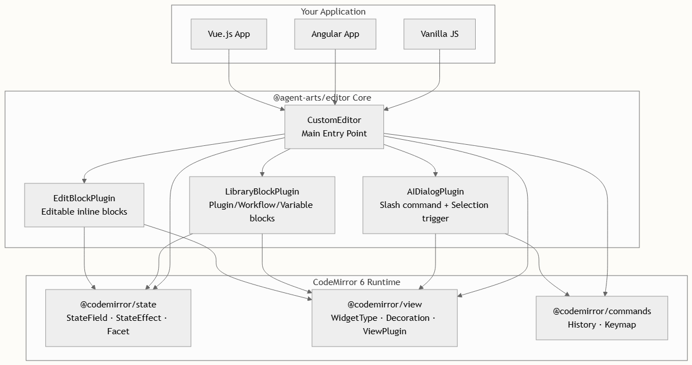

# 概述

`@agent-arts/editor` 是一个基于 `CodeMirror 6` 构建的提示词编辑器，专为编写和优化 AI agent 提示词而设计。它与框架无关——这意味着你可以将其嵌入到 `Vue.js``、Angular` 或任何原生 JavaScript 环境中——并且作为一个单一的 npm 包发布，核心层与框架零耦合。该编辑器引入了三种超越纯文本编辑的专属交互模式：`可编辑块`、`插件/工作流块`，以及用于通过对话生成提示词的 `AI 对话框`。这些特性使其尤其适合用于构建需要结构化提示词编排的 AI agent 配置界面。

## 你可以用它构建什么？

下方的产品演示动画展示了三种核心交互模式的实际运行效果：


以下是这三种内置能力的简要解析：

| 特性 | 触发方式 | 行为表现 | 典型用例 |
| --- | --- | --- | --- |
| 编辑块 | 点击行内块 | 打开配置弹窗以编辑占位文本和预设内容 | 用户自定义的提示词变量，如“用户意图”或“上下文” |
| 资源库块 | 输入 `{` | 显示一个列出可用插件、工作流和变量的下拉菜单 | 插入 MCP 服务引用、工作流节点、系统变量 |
| AI 对话框 | 输入 `/` 或选中文本 | 打开一个对话面板，用于 AI 辅助生成提示词 | 生成新的提示词段落、使用 AI 优化现有文本 |

上述每一个特性均作为`独立插件`实现——你可以引入全部三个，也可以仅挑选应用所需的插件。核心编辑器本身保持轻量，仅依赖于三个 CodeMirror 6 包：`@codemirror/state`、`@codemirror/view` 和 `@codemirror/commands`。


## 宏观架构

该编辑器遵循`以插件为中心的架构`，每一项功能都被封装为 CodeMirror 扩展。这意味着每个功能——包括块、弹窗、触发器——都是自包含的，可独立测试，并能与其他功能组合。下图展示了这种分层结构：



处于核心位置的是 `CustomEditor` 类，它作为使用者唯一的入口点。该类接收一个 `CustomEditorOptions` 配置对象，负责协调 CodeMirror `EditorState` 的初始化，组装所有插件扩展，并暴露公共 API 以便通过编程方式操作块和检索序列化后的内容。

## Monorepo 结构

该项目采用 pnpm workspace monorepo 形式组织，包含三个包。这种分离确保了核心编辑器库保持与框架无关，同时为两个最常用的框架提供了参考实现：

```
agent-arts/editor
├── packages/
│   ├── core/              ← @agent-arts/editor (npm package)
│   │   └── src/
│   │       ├── core.ts            CustomEditor class & serialization
│   │       ├── types.ts           EditorBlock, PluginBlock, EditorData
│   │       ├── const.ts           SVG icons for block rendering
│   │       └── plugins/
│   │           ├── edit-block.ts         Editable block plugin
│   │           ├── library-block.ts      Plugin/workflow/variable plugin
│   │           └── ai-dialog.ts          AI conversation trigger plugin
│   │
│   ├── site/              ← Vue 3 demo site
│   │   └── src/components/
│   │       └── Editor.vue                Full Vue integration example
│   │
│   └── site-ng/           ← Angular demo site
│       └── src/app/editor/
│           └── agent-prompt-editor.component.ts
│                                       Angular + ControlValueAccessor
```

`packages/core` 目录是实现编辑器功能的唯一位置。`site` 和 `site-ng` 目录仅包含 UI 展示代码——弹窗、下拉列表以及特定框架的生命周期管理。这是在 `AGENTS.md` 中明确记录的项目规范。

## 框架集成概览

由于核心编辑器是纯 TypeScript 且不依赖任何框架，将其集成到你的应用中只需将其挂载到一个 DOM 元素即可。两个演示站点展示了两种主要的集成模式：

| 方面 | Vue 3 (`packages/site`) | Angular (`packages/site-ng`) |
| --- | --- | --- |
| 挂载方式 | `onMounted` + `ref<HTMLElement>` | `@ViewChild` + `ElementRef` |
| 表单绑定 | 通过 `ref` + `onChange` 回调实现 `v-model` | `ControlValueAccessor` + `NG_VALUE_ACCESSOR` |
| 清理工作 | `onUnmounted` → `editor.destroy()` | `OnDestroy` → `editor.destroy()` |
| 弹窗渲染 | 带有 `v-if` 指令的 Vue 模板 | 带有 `ngIf` 指令的 Angular 模板 |
| 变更检测 | Vue 的响应式系统（自动） | 手动调用 `ChangeDetectorRef.detectChanges()` |

两种实现展示了相同的原则：编辑器核心触发回调函数（如 `onOpenPopup`、`onTriggerPluginPopup`、`onTriggerAIDialog`），而框架层负责渲染对应的 UI 并将结果回传给编辑器。

## 快速开始

安装该编辑器非常简单——它是一个单一的 npm 包，仅有三个 CodeMirror 同级依赖，且作为直接依赖一并安装：

```bash
npm install @agent-arts/editor
```

最基础的集成只需要一个 DOM 容器和几个回调处理函数：

```typescript
import { CustomEditor, CustomEditorOptions } from '@agent-arts/editor';
 
const options: CustomEditorOptions = {
  parent: document.querySelector('#editor')!,
  initialDoc: '  onOpenPopup: (id, rect) => { /* show edit block popup */ },
  onTriggerPluginPopup: (pos) => { /* show plugin dropdown */ },
  onTriggerAIDialog: (pos) => { /* show AI dialog */ }
};
 
const editor = new CustomEditor(options);
```

> `parent` 选项必须是一个真实的 DOM 元素——编辑器不会创建自己的容器。在构造 `CustomEditor` 之前，请确保该元素已经存在于 DOM 中。在 Angular 等框架中，请使用 `setTimeout` 或 AfterViewInit 来保证 DOM 已就绪。

## 后续步骤

本页从宏观视角介绍了 @agent-arts/editor 是什么及其结构组成。接下来你可以继续探索：

- 快速开始 —— 在本地设置和运行项目的分步指南，包含详细的配置说明。
- Monorepo 布局 —— 深入了解三个包之间的关联，包括构建脚本和开发工作流。
- 架构概述 —— 全面深入剖析 CodeMirror 扩展系统、插件生命周期以及数据序列化内部机制。

如需特定框架的集成指南，请直接跳转至 Vue 集成 或 Angular 集成。