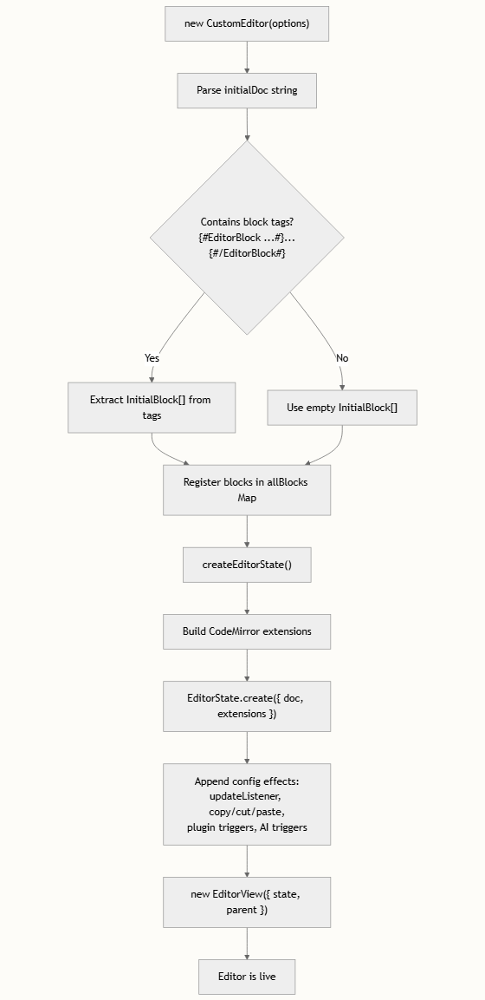

# 快速开始

本页将引导你完成 `@agent-arts/editor` 的安装、初始化与交互操作。这是一个基于 CodeMirror 6 构建的、不依赖特定框架的提示词编辑器，专为 AI agent 工作流设计。阅读完本文档后，你将获得一个可运行的编辑器实例，并具备全部三大核心功能：可编辑块、插件块以及 AI 对话触发器。


## 前置条件

在继续操作之前，请确保你的环境满足以下最低要求。该编辑器以 ES 模块形式发布，并依赖三个 CodeMirror 6 的 peer 包，因此必须使用支持 import 语法的打包工具。

| 要求 | 最低版本 | 用途 |
| --- | --- | --- |
| Node.js | ≥ 18 | pnpm / npm 的运行环境 |
| pnpm | ≥ 8（推荐） | Monorepo 工作区管理 |
| 打包工具 | Vite ≥ 5、Webpack ≥ 5 或 Angular CLI | ES 模块解析与 Tree-shaking |

该包将其 CodeMirror 依赖声明为 `dependencies`（而非 `peerDependencies`），这意味着在 UMD 格式的库输出中它们会被打包在内，而对于 ESM 消费者则会将其外部化 packages/core/package.json。在实际开发中，你的打包工具会自动处理去重逻辑。

## 安装

从 npm 注册表安装该编辑器包。如果你直接在 monorepo 内工作，请跳过此步骤 —— 工作区协议会自动将 `packages/site` 和 `packages/site-ng` 链接到 `packages/core`。

```bash
npm install @agent-arts/editor
# 或者
pnpm add @agent-arts/editor
```

发布的包包含编译后的 ES 模块（`editor.js`）、UMD 构建产物（`editor.umd.cjs`）以及打包后的类型声明文件（`index.d.ts`）—— 这些均由 Vite 在库模式下生成，并配合 `vite-plugin-dts` 插件用于类型汇总。

## 60 秒极简上手

要快速运行一个可用的编辑器，只需要两样东西：一个容器 DOM 元素和一个 CustomEditorOptions 配置对象。以下是最精简的实现方式：

```html
<!-- index.html -->
<div id="editor" style="height: 400px;"></div>
```

```typescript
// main.ts
import { CustomEditor } from '@agent-arts/editor';
 
const editor = new CustomEditor({
  parent: document.querySelector('#editor')!,
  initialDoc: '# Welcome to AgentArts Editor',
  onOpenPopup: (id, rect) => console.log('Popup for block:', id, rect),
  onTriggerPluginPopup: (pos) => console.log('Plugin popup at position:', pos),
  onTriggerAIDialog: (pos) => console.log('AI dialog at position:', pos),
});
```

仅仅通过这单次 `new CustomEditor(options)` 调用，即可初始化一个完整的 CodeMirror 6 编辑器状态，包含历史记录、默认键位映射、Markdown 标题样式以及三个内置的触发器扩展。

初始化过程的架构可视化如下：



> `parent` 元素必须具有明确的高度（例如 `height: 400px` 或 `flex: 1`）。否则，编辑器将折叠为零高度，因为 CodeMirror 视图会从其父元素继承 `height: 100%`。

## 理解配置接口

所有的配置项均声明在 `CustomEditorOptions` 接口中。下表详细拆解了每个属性、其用途以及是否为必填项。

| 属性	| 类型	| 是否必填	| 描述
| --- | --- | --- | --- |
| parent	| HTMLElement	| ✅	| 承载编辑器视图的 DOM 元素 |
| initialDoc	| string	| ✅	| 初始文档内容；支持块序列化标签 |
| initialBlocks	| InitialBlock[]	| ❌	| 编程式的块定义（作为内联标签的替代方案） |
| onOpenPopup	| (id, rect) => void	| ✅	| 当编辑块获得焦点时触发 |
| onTriggerPluginPopup	| (pos) => void	| ✅	| 当用户输入 { 时触发 |
| onHidePluginPopup	| () => void	| ❌	| 当 { 触发符被删除时触发 |
| onTriggerAIDialog	| (pos) => void	| ✅	| 当用户输入 / 或选中文本时触发 |
| onHideAIDialog	| () => void	| ❌	| 当 / 触发符被删除时触发 |
| onChange	| (data) => void	| ❌	| 每次文档变更时触发，携带序列化后的内容 |
| onBlockDeleted	| (id) => void	| ❌	| 当块通过退格键被移除时触发 |
| onBlockUpdated	| (id, text) => void	| ❌	| 当编辑块的文本内容发生变化时触发 |

这三个必填的回调函数（`onOpenPopup`、`onTriggerPluginPopup`、`onTriggerAIDialog`）反映了该编辑器的事件驱动设计理念：`核心包负责检测与光标追踪，但将所有 UI 渲染工作都委托给你的框架去实现`。

## 核心 API 速查表

一旦实例化完成，`CustomEditor` 类便会暴露一个精简却完备的公共接口。以下是你会在应用代码中调用的方法。

| 方法	| 签名	| 用途 |
| --- | --- | --- |
| addBlock()	() => EditorBlock	| 在当前光标位置插入一个新的编辑块 |
| addPluginBlock()	(pos, block) => PluginBlock	| 将 `{` 占位符替换为插件/工作流组件 |
| addVariableBlock()	(pos, name) => PluginBlock	| 在指定位置插入 `{{name}}` 变量标记 |
| syncBlock()	(block: EditorBlock) => void	| 将外部状态变更推送到已有的编辑块中 |
| getBlock()	(id: string) => EditorBlock | undefined	| 通过 ID 获取块 |
| getData()	() => EditorData	| 返回带有块标签的完整文档序列化字符串 |
| `coordsAtPos()	(pos) => {left, top, …}`	| 返回用于定位浮动 UI 的屏幕坐标 |
| destroy()	() => void	| 销毁 CodeMirror 视图并清理资源 |

> 请在你框架的卸载生命周期中调用 `editor.destroy()`（例如 Vue 的 `onUnmounted` 或 Angular 的 `ngOnDestroy`）。如果未能执行此操作，将导致 CodeMirror 视图的 DOM 事件监听器发生内存泄漏。

## 特定框架集成示例

该编辑器不依赖特定框架 —— 它只需要一个 DOM 元素。以下是针对 Vue 3 和 Angular 的具体示例，这两种框架的演示均包含在 monorepo 的示例应用中。

### Vue 3 集成

`packages/site` 示例应用展示了推荐的模式：创建一个模板引用（template ref），在 `onMounted` 中实例化编辑器，并将回调函数桥接到响应式状态。

```html
<script setup lang="ts">
import { ref, onMounted, onUnmounted } from 'vue'
import { CustomEditor } from '@agent-arts/editor'
 
const editorHostRef = ref<HTMLElement>()
const editor = ref<CustomEditor>()
 
onMounted(() => {
  editor.value = new CustomEditor({
    parent: editorHostRef.value!,
    initialDoc: '# My Prompt\n\nYou are a helpful assistant.',
    onOpenPopup: (id, rect) => { /* open your config panel */ },
    onTriggerPluginPopup: (pos) => { /* show plugin picker */ },
    onTriggerAIDialog: (pos) => { /* show AI dialog */ },
    onChange: (data) => console.log('Content changed:', data),
  })
})
 
onUnmounted(() => {
  editor.value?.destroy()
})
</script>
 
<template>
  <div ref="editorHostRef" style="height: 500px; border: 1px solid #ccc;" />
</template>
```

## Angular 集成

`packages/site-ng` 示例将编辑器封装在一个独立组件中，并通过 `ControlValueAccessor` 实现与 Angular 表单的兼容。

```typescript
@Component({
  selector: 'app-agent-prompt-editor',
  template: `<div #editorHost style="height: 500px;"></div>`,
})
export class AgentPromptEditorComponent implements AfterViewInit, OnDestroy {
  @ViewChild('editorHost') editorHost!: ElementRef;
  private editor: CustomEditor | null = null;
 
  ngAfterViewInit() {
    this.editor = new CustomEditor({
      parent: this.editorHost.nativeElement,
      initialDoc: '# Angular Editor',
      onOpenPopup: (id, rect) => { /* ... */ },
      onTriggerPluginPopup: (pos) => { /* ... */ },
      onTriggerAIDialog: (pos) => { /* ... */ },
    })
  }
 
  ngOnDestroy() {
    this.editor?.destroy()
  }
}
```

若要了解更深层次的集成模式 —— 包括 `ControlValueAccessor`、响应式表单绑定以及 Angular Signals —— 请参阅 Angular 集成 与 ControlValueAccessor 模式。

## 在本地运行 Monorepo

如果你想探索完整的源码或参与贡献，该 monorepo 使用 pnpm workspaces 将三个包链接在一起。

工作区的目录结构直接映射了架构层面的关注点：

```
packages/
├── core/          → @agent-arts/editor  (发布的库)
├── site/          → Vue 3 演示应用       (localhost:5173/editor/)
└── site-ng/       → Angular 18 演示应用  (localhost:4200/)
```

### 操作步骤

```bash
# 1. 克隆仓库
git clone https://github.com/agent-arts/editor.git
cd editor
 
# 2. 安装所有依赖（pnpm 会自动解析 workspace:* 协议）
pnpm install
 
# 3. 启动 Vue 演示（核心包变更时自动重构 + 启动站点服务）
pnpm dev
 
# 4. 或者启动 Angular 演示
pnpm dev:ng
```

根目录下的 `pnpm dev` 脚本使用 `concurrently` 并行运行两个进程：`build:watch`（针对 `@agent-arts/editor` 的 Vite 监听模式）和 `pnpm -F site dev`（Vue 开发服务器）。这意味着对核心包的任何更改都会触发自动重构，且演示应用能够即时感知到更新。

| 脚本 |	运行位置	| 作用 |
| pnpm dev |	根目录	| 监听核心包 + 在 :5173 启动 Vue 站点 |
| pnpm dev:ng |	根目录	| 构建一次核心包 + 在 :4200 启动 Angular 站点 |
| pnpm build:lib |	根目录	| 对 `@agent-arts/editor` 进行生产环境构建 |
| pnpm build |	根目录	| 对 Vue 演示站点进行生产环境构建 |

## 内容序列化格式

该编辑器的一大特色在于其**基于标签的序列化机制**。当你调用 `editor.getData()` 时，所有的编辑块和插件块都会被序列化为人类可读的字符串格式。该格式可被存储、传输，并能够重新解析为实时的编辑器状态。在创建新的编辑器实例时，该格式同样可作为 `initialDoc` 使用。

```typescript
// 调用 editor.getData() 输出的序列化结果示例
const serialized = `# 角色
 
你是一个 {#EditorBlock id="b1" placeholder="请输入角色描述"#}智能助手{#/EditorBlock#}。
插件：{#PluginBlock id="p1" type="plugin"#}MCP服务01{#/PluginBlock#}
工作流：{#PluginBlock id="w1" type="workflow"#}Bing搜索{#/PluginBlock#}`
```

`parseEditorContentString` 中的解析逻辑会扫描 `{#EditorBlock` 和 `{#PluginBlock` 开始标签，提取属性（id、placeholder、type），读取内部的文本内容，并在编辑器文档中将每个标签替换为单个 Unicode 对象替换字符（`\uFFFC`）。这也是驱动复制/粘贴功能的同一套机制：当你复制包含块的选区时，剪贴板会接收到序列化格式，而在粘贴时则会重新将其解析为实时组件。

## 后续步骤

既然你已经拥有了一个运行中的编辑器，以下是根据你接下来的目标所推荐的阅读路径：

- 理解完整架构 → 架构概述 解释了插件系统、StateField/StateEffect 模式，以及三个核心插件之间是如何协同工作的。
- 自定义编辑器类 → CustomEditor 类 API 提供了包含详细参数说明的完整 API 参考。
- 深入探索块类型 → 块类型系统 与 内容序列化格式 涵盖了编辑块和插件块的内部机制。
- 集成特定框架 → Vue 集成 或 Angular 集成 提供了可直接用于生产环境的模式。
